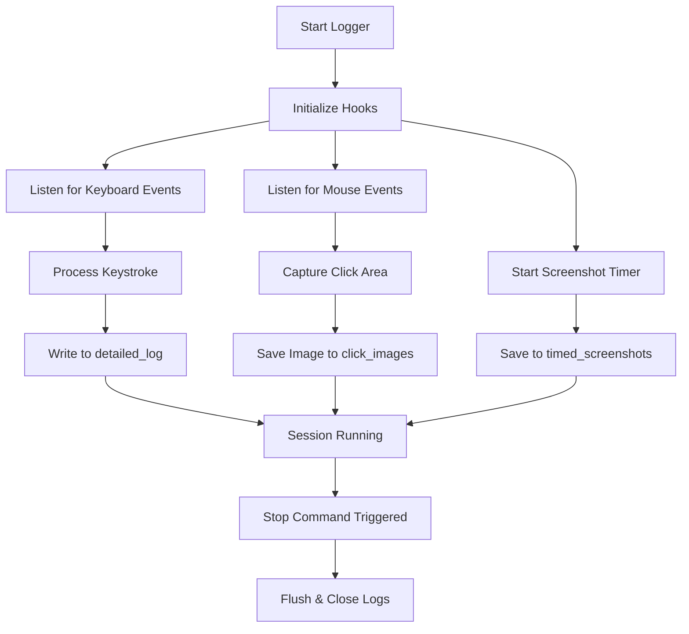
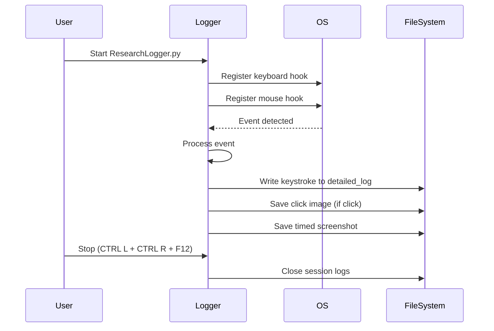
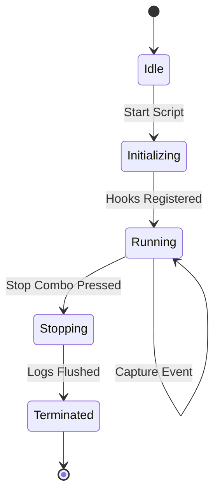
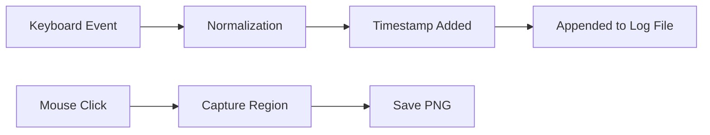
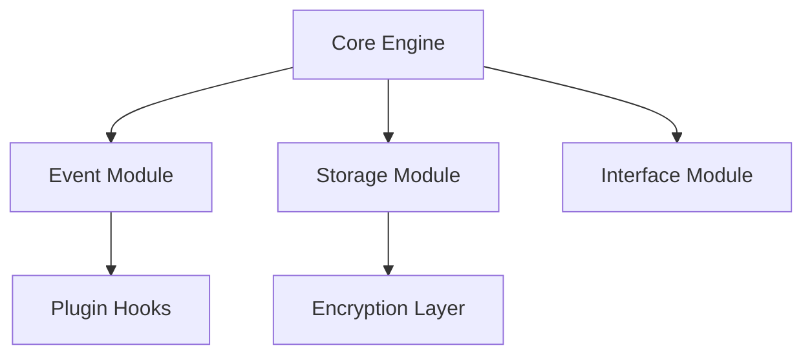

# Core Component: Event Logging Engine

The heart of ResearchLogger is the event monitoring system implemented in:

- `ResearchLogger.py`
- Supporting system-level hooks (Xlib on Linux)

The system captures:

- Keyboard strokes
- Mouse clicks
- Timed screenshots
- Click-area screenshots

---

# High-Level Logging Flow



---

# Execution Sequence (Runtime Behavior)



---

# Automata State Diagram

The logger behaves like a simple deterministic finite automaton (DFA).



### States Explained

| State | Description |
|-------|-------------|
| Idle | Script not running |
| Initializing | System hooks and timers setup |
| Running | Capturing events and writing logs |
| Stopping | Stop signal received |
| Terminated | Clean shutdown complete |

---

# Data Lifecycle



---

# Internal Responsibilities

## Event Capture

Uses OS-level hooks (Linux via Xlib).

Responsible for:
- Listening to raw events
- Triggering callbacks

---

## Event Processing

Transforms raw input into structured log entries:

Example log format:

```
timestamp | key | action_type
```

Adds:
- Time precision
- Session context
- System metadata

---

## Storage Layer

Structured folder-based storage:

```
/click_images
/detailed_log
/system_log
/timed_screenshots
```

Design choice:  
Avoid database dependency for portability.

---

# Design Decisions

## Why File-Based Logging?

✔ No external database required  
✔ Easy experiment portability  
✔ Research reproducibility  
✔ Simpler deployment  

~~Database-backed logging~~ (considered but rejected for complexity)

---

# Stop Mechanism Design

Stop combo:

```
CTRL (left) + CTRL (right) + F12
```

Why dual CTRL?

- Reduces accidental termination
- Acts as deliberate interrupt signal
- Simple implementation without GUI dependency

---

# Security & Ethical Considerations

This system:

- Captures sensitive input
- Stores screen content
- Logs behavioral patterns

Therefore:

- Must be used with informed consent
- Should never run invisibly
- Should not be deployed in production environments

~~Background stealth monitoring~~ is explicitly out of scope.

---

# Known Technical Limitations

- Linux-first implementation
- GUI does not auto-start logger
- No encryption of log files
- No session authentication

Future improvements could include:

- Log encryption
- Session hashing
- Modular plugin hooks
- Structured JSON logging

---

# Extension Points

Advanced contributors could extend:

### 1. Storage Backend
Replace file-based logging with:
- SQLite
- JSON structured logs
- Remote storage API

### 2. Event Filtering
Add:
- Key category filtering
- Application-specific capture
- Sampling intervals

### 3. Visualization Layer
Build:
- Real-time dashboard
- Post-session analytics tool
- Keystroke heatmaps

---

# Architectural Maturity Level

Current architecture:  
Simple procedural logging engine.

Target architecture (future):



---

# Summary

The most interesting aspect of ResearchLogger is not the GUI.

It is the **event-driven logging engine**, which:

- Hooks into OS input streams
- Processes real-time events
- Persists structured experiment data
- Maintains deterministic session lifecycle

It behaves as a finite-state event machine with file-based persistence.

That simplicity is what makes it academically powerful.

---

# For Contributors

Before modifying:

1. Understand the state lifecycle
2. Respect experiment reproducibility
3. Maintain folder structure consistency
4. Avoid introducing hidden background behavior

Clarity > Cleverness

---

End of architecture documentation.