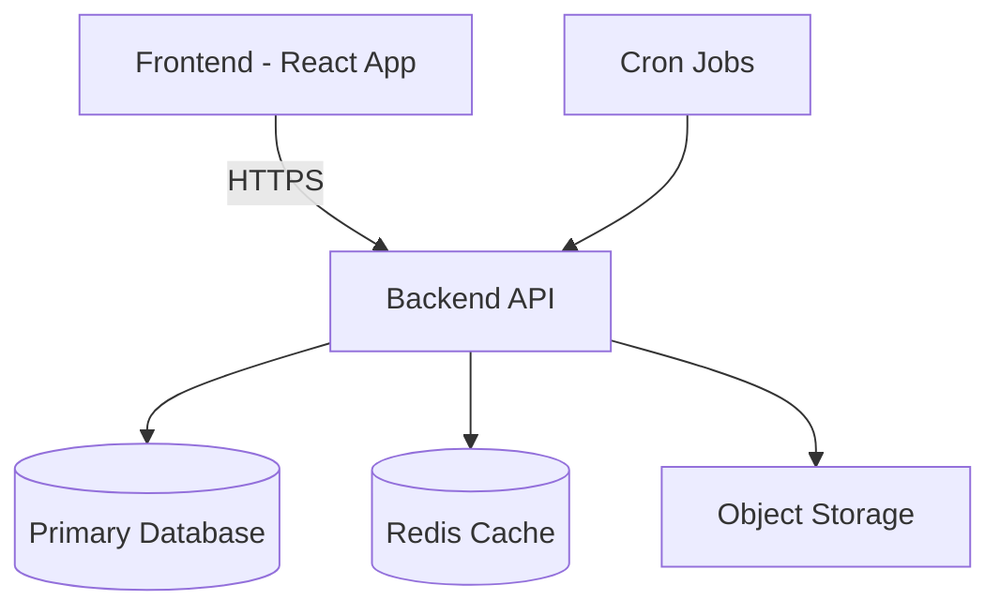
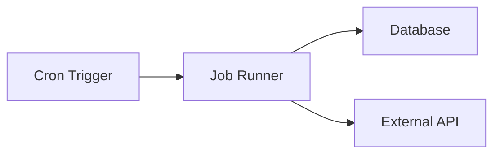
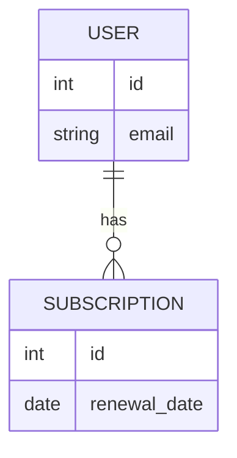
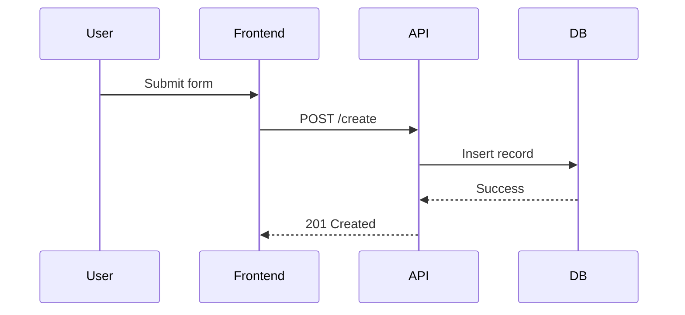
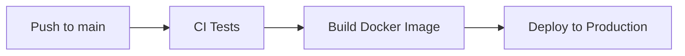

# System Architecture Documentation

Project Name:  
Last Updated:  
Maintainer:  

---

# 1. System Overview

Short description of what the system does.

Example:

This system provides a REST API for managing user subscriptions,
processes background billing tasks, and serves a web dashboard for admins.

---

# 2. High-Level Architecture



---

# 3. Components

## 3.1 Frontend

- Framework:
- Hosted at:
- Deployment strategy:
- Authentication method:
- How it communicates with backend:

Example:

The frontend communicates with the backend via HTTPS using JWT authentication.
All API calls are made to `/api/v1/*`.

---

## 3.2 Backend API

- Language:
- Framework:
- Entry point:
- Deployment location:
- Environment:

Example:

The backend runs as a Docker container inside AWS ECS.
It exposes REST endpoints under `/api/v1`.

---

## 3.3 Background Jobs / Cron

### What Runs?

| Job Name | Schedule | Purpose |
|----------|----------|----------|
| billing_job | Daily at 02:00 UTC | Process subscription renewals |
| cleanup_job | Every 6 hours | Remove expired sessions |

### How They Run

- OS cron
- Kubernetes CronJob
- Celery beat
- GitHub scheduled workflow

Example mermaid:



---

# 4. API Documentation

## Base URL

```
https://api.company.com
```

## Authentication

- JWT Bearer token
- Token issued via `/auth/login`

## Example Request

```http
POST /api/v1/users
Authorization: Bearer <token>
```

## Example Response

```json
{
  "id": 1,
  "email": "user@example.com"
}
```

---

# 5. Database Architecture

## Primary Database

- Type: PostgreSQL
- Hosted at: AWS RDS
- Access: Private subnet only
- Backup strategy: Daily snapshot

### ER Diagram (Optional)



---

# 6. Data Flow



---

# 7. Deployment Architecture

## Environments

| Environment | URL | Purpose |
|------------|-----|----------|
| Local | localhost | Development |
| Staging | staging.company.com | Pre-production testing |
| Production | company.com | Live |

## CI/CD Flow



---

# 8. Configuration & Environment Variables

| Variable | Purpose | Required |
|----------|----------|----------|
| DATABASE_URL | Database connection | Yes |
| REDIS_URL | Cache | Yes |
| SECRET_KEY | JWT signing | Yes |

---

# 9. Security Considerations

- Authentication method:
- Authorization model:
- Data encryption:
- Secrets management:
- CORS policy:
- Rate limiting:

---

# 10. Logging & Observability

- Application logs location:
- Log aggregation tool:
- Monitoring tool:
- Alerting mechanism:
- Metrics collected:

Example:

- Logs stored in CloudWatch
- Metrics tracked via Prometheus
- Alerts sent to Slack

---

# 11. Failure Modes

| Scenario | Expected Behavior |
|----------|-------------------|
| Database down | API returns 503 |
| Cron fails | Retries 3 times |
| Token expired | 401 Unauthorized |

---

# 12. Scaling Strategy

- Horizontal scaling?
- Load balancer?
- Stateless backend?
- Database read replicas?

---

# 13. Known Limitations

- No multi-region failover
- No automatic retry for failed webhooks
- Single database instance

---

# 14. Extension Points

- Replace storage backend
- Add message queue
- Add analytics pipeline
- Introduce microservices

---

# 15. Glossary

Define important terms:

- Session
- Worker
- Hook
- Job
- Event

---

# 16. Architectural Principles

Example:

- Simplicity over abstraction
- Stateless services
- Clear separation of concerns
- Explicit over implicit behavior

---

# 17. For New Developers

To understand this system:

1. Start with the high-level diagram
2. Review API routes
3. Inspect data models
4. Run the project locally
5. Trace one request end-to-end

---

End of Architecture Documentation